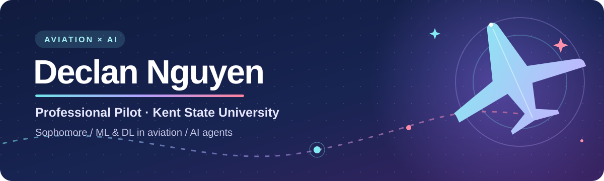

  

  
  

## Hi, I'm Declan

I'm a **sophomore in the Professional Pilot program at Kent State University**. I'm drawn to the place where aviation meets intelligent systems: using **machine learning and deep learning** to explore real aviation problems, and building useful applications with **applied AI and AI agents**.

> Pilot mindset. AI curiosity. Always learning.

## What I'm exploring

| Aviation + ML/DL | Applied AI | AI agents |
| :--- | :--- | :--- |
| Data-driven approaches to flight operations, aircraft imagery, and aviation safety. | Turning models into practical tools that people can use. | Systems that can reason, plan, and help with meaningful workflows. |

## Featured work

| Project | What it explores |
| :--- | :--- |
| [**ConvNeXt Aircraft Detector**](https://github.com/nguyenhuynh110907-ops/convnext-aircraft-detector) | Aircraft object detection with ConvNeXt-Tiny, FPN, and Faster R-CNN. |
| [**BTS Flight Delay Prediction**](https://github.com/nguyenhuynh110907-ops/bts-flight-delay-prediction) | Predicting U.S. flight delays before departure using BTS data and chronological evaluation. |
| [**UAV Safe RL Reproduction**](https://github.com/nguyenhuynh110907-ops/uav-safe-rl-reproduction) | Comparing quadrotor PID, PPO, and PPO + MPSC under disturbances and actuator loss. |

## Let's connect

I'm always happy to talk about aviation, ML/DL research ideas, applied AI, or agentic systems. Reach me at **[nguyenhuynh110907@gmail.com](mailto:nguyenhuynh110907@gmail.com)**.

Made with curiosity, code, and a love of flight.

